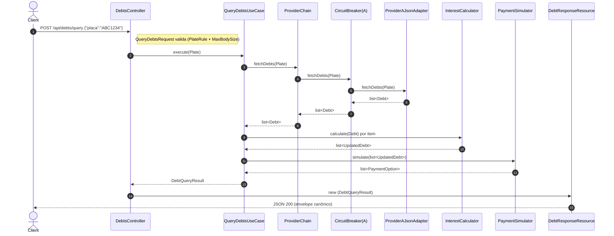

# Serviço de Consulta e Simulação de Débitos Veiculares

API HTTP em PHP/Laravel que recebe uma placa veicular, consulta dois providers externos
(JSON e XML), calcula juros sobre débitos em atraso e simula formas de pagamento
(Pix com desconto e Cartão em 1x/6x/12x).

> Especificação detalhada (regras de domínio, invariantes, mapa de arquivos, armadilhas
> conhecidas) vive em [`CLAUDE.md`](CLAUDE.md).

---

## Visão geral

- **Arquitetura:** hexagonal em 3 camadas (`Domain` → `Application` → `Infrastructure`).
- **Precisão monetária:** `brick/math` (`BigDecimal`) de ponta a ponta. Nenhum `float` em
  código de domínio ou adapters.
- **Resiliência:** chain sequencial de providers (JSON → XML), retry com backoff em
  `ConnectionException`/5xx, circuit breaker in-memory por provider, budget global de 5s.
- **LGPD:** placas mascaradas em todo log via processor global do Monolog.
- **Cobertura:** 200 testes Pest / 421 assertions, gate de **100% no Domain + Application** no CI.

---

## Como rodar

### Setup local (Composer + PHP 8.2+)

```bash
# 1. Clonar e instalar dependências
composer install

# 2. Configurar ambiente
cp .env.example .env
php artisan key:generate

# 3. Rodar a API
composer dev
# → http://localhost:8000
# (atalho para `PHP_CLI_SERVER_WORKERS=4 php artisan serve --no-reload` —
#  workers concorrentes são necessários para que o mesmo servidor consiga atender
#  o /api/debts/query e o loopback /mock/provider-a|b sem se bloquear; o
#  --no-reload é obrigatório porque o Laravel só respeita PHP_CLI_SERVER_WORKERS
#  quando o wrapper de file-watching está desligado)
```

Os mocks dos providers já estão registrados em `routes/web.php` (guardados por
`! app()->isProduction()`), apontados pelas variáveis `PROVIDER_A_URL` e `PROVIDER_B_URL`
do `.env.example`. **Não precisa subir nada extra** para testar end-to-end:

```bash
curl -s http://localhost:8000/mock/provider-a/debts/ABC1234 | jq
curl -s http://localhost:8000/mock/provider-b/debts/ABC1234
```

### Setup com Docker (alternativa)

Não há `Dockerfile` no repo ainda. Para containerizar:

```dockerfile
FROM php:8.3-cli-alpine
COPY . /app
WORKDIR /app
RUN composer install --no-dev --optimize-autoloader
CMD ["php", "artisan", "serve", "--host=0.0.0.0", "--port=8000"]
```

### Sobrescrever taxas/timeouts em runtime (sem refactor)

Todas as 14 constantes de regra de negócio + infra moram em [`config/business.php`](config/business.php), com fallback para defaults canônicos do enunciado. Para mudar em demo, descomente a linha no `.env` e reinicie:

```bash
# Exemplos
IPVA_DAILY_RATE=0.005       # IPVA a 0,5%/dia
IPVA_CAP_RATE=0.15          # teto do juro pra 15% do valor
MULTA_DAILY_RATE=0.02       # MULTA a 2%/dia
PIX_DISCOUNT_FACTOR=0.90    # Pix com 10% de desconto
CC_MONTHLY_RATE=0.03        # cartão a 3% a.m.
PROVIDER_A_TIMEOUT=5        # timeout HTTP do Provider A (segundos)
CHAIN_BUDGET_SECONDS=10     # budget total do chain
CB_FAILURE_THRESHOLD=3      # trip circuit em 3 falhas
HTTP_MAX_BODY_BYTES=2097152 # aumentar body limit pra 2 MiB
```

Lista completa em `.env.example`. `CLAUDE.md` §0 mostra tabela compacta para consulta rápida durante apresentação.

### Rodar os testes

```bash
composer test                       # 207 passed (431 assertions) — Pest
composer test:coverage              # exige 100% no app/Domain + app/Application (precisa de Xdebug/PCOV)
./vendor/bin/pest --filter=Money    # filtra um teste específico
./vendor/bin/pint --test            # checa estilo (Laravel Pint)
```

O CI (`.github/workflows/ci.yml`) roda matriz PHP 8.2 + 8.3, Pint dry-run, e gate de
cobertura **100% em Domain + Application** em todo PR.

### Trace de demo no console

Quando rodando fora de produção (`APP_ENV != production`), cada request para
`/api/debts/query` emite uma sequência de linhas coloridas no `stderr` do
servidor mostrando cada passo:

```
→ POST /api/debts/query  placa=ABC****
→ ProviderChain: trying 2 providers (budget=5.0s)
  ✗ Provider A failed: Provider A unreachable: ... (elapsed 2.41s)
  ⚡ circuit-Provider A OPEN — skipping
  ✓ Provider B returned 2 debts (elapsed 0.18s)
✓ calculated interest for 2 debts
✓ simulated payments: 2 options [TOTAL, SOMENTE_IPVA]
← 200 (total 2.61s)
```

O tracer é implementado como port `QueryTracer` (Application) + adapter
`DemoLogger` (Infrastructure) que escreve no canal `demo` configurado em
[`config/logging.php`](config/logging.php). Em produção o construtor faz
short-circuit e todo método vira no-op — overhead zero. Placas continuam
passando pelo `PlateMaskingProcessor` global (mascaradas como `ABC****`).

Para desabilitar manualmente em dev, basta `APP_ENV=production` ou remover
o middleware `DemoRequestLogger` do api group em [`bootstrap/app.php`](bootstrap/app.php).

---

## Endpoints

| Método | Rota | Descrição |
|---|---|---|
| `POST` | `/api/debts/query` | Consulta débitos de uma placa e devolve simulações de pagamento. |
| `GET` | `/api/health` | Health check (smoke). |
| `GET` | `/up` | Health check default do Laravel. |
| `GET` | `/mock/provider-a/debts/{plate}` | Mock JSON (dev/test only). |
| `GET` | `/mock/provider-b/debts/{plate}` | Mock XML (dev/test only). |

### Mapa de status

| Status | Quando | Body |
|---|---|---|
| `200` | Happy path | Envelope canônico (`placa`, `debitos`, `resumo`, `pagamentos`) |
| `400` | `InvalidPlateException` fora do FormRequest | `{"error":"invalid_plate"}` |
| `413` | Body > 1 MiB | `{"error":"payload_too_large","max_bytes":...,"received_bytes":...}` |
| `422` | Validação do `placa` falhou | `{"error":"validation_failed","errors":{...}}` |
| `422` | Campos extras no body | `{"error":"unknown_fields","unknown_fields":[...]}` |
| `422` | Provider retornou tipo desconhecido | `{"error":"unknown_debt_type","type":"..."}` |
| `503` | Todos os providers indisponíveis | `{"error":"all_providers_unavailable"}` |

### Exemplos de uso (cURL)

#### Happy path
```bash
curl -X POST http://localhost:8000/api/debts/query \
  -H 'Content-Type: application/json' \
  -d '{"placa":"ABC1234"}' | jq
```

Output esperado (resumido):
```json
{
  "placa": "ABC1234",
  "debitos": [
    { "tipo": "IPVA",  "valor_original": "1500.00", "valor_atualizado": "1800.00", "vencimento": "2024-01-10", "dias_atraso": 121 },
    { "tipo": "MULTA", "valor_original": "300.50",  "valor_atualizado": "555.93",  "vencimento": "2024-02-15", "dias_atraso": 85 }
  ],
  "resumo": { "total_original": "1800.50", "total_atualizado": "2355.93" },
  "pagamentos": {
    "opcoes": [
      { "tipo": "TOTAL",         "valor_base": "2355.93", "pix": { "total_com_desconto": "2238.13" }, "cartao_credito": { "parcelas": [ {"quantidade":1,"valor_parcela":"2355.93"}, {"quantidade":6,"valor_parcela":"427.72"}, {"quantidade":12,"valor_parcela":"229.67"} ] } },
      { "tipo": "SOMENTE_IPVA",  "valor_base": "1800.00", "pix": { "total_com_desconto": "1710.00" }, "cartao_credito": { "parcelas": [ {"quantidade":1,"valor_parcela":"1800.00"}, {"quantidade":6,"valor_parcela":"326.79"}, {"quantidade":12,"valor_parcela":"175.48"} ] } },
      { "tipo": "SOMENTE_MULTA", "valor_base": "555.93",  "pix": { "total_com_desconto": "528.13" },  "cartao_credito": { "parcelas": [ {"quantidade":1,"valor_parcela":"555.93"},  {"quantidade":6,"valor_parcela":"100.93"}, {"quantidade":12,"valor_parcela":"54.20"}  ] } }
    ]
  }
}
```

#### Placa inválida → 422
```bash
curl -i -X POST http://localhost:8000/api/debts/query \
  -H 'Content-Type: application/json' \
  -d '{"placa":"INVALID"}'

# HTTP/1.1 422 Unprocessable Entity
# {"error":"validation_failed","errors":{"placa":["The placa must be a valid Brazilian plate (ABC1234 or ABC1D23)."]}}
```

#### Campo extra → 422
```bash
curl -i -X POST http://localhost:8000/api/debts/query \
  -H 'Content-Type: application/json' \
  -d '{"placa":"ABC1234","extra":"noise"}'

# HTTP/1.1 422 Unprocessable Entity
# {"error":"unknown_fields","unknown_fields":["extra"]}
```

#### Body grande demais → 413
```bash
curl -i -X POST http://localhost:8000/api/debts/query \
  -H 'Content-Type: application/json' \
  -d "$(printf '{"placa":"ABC1234","noise":"%*s"}' 1048600 x)"

# HTTP/1.1 413 Payload Too Large
# {"error":"payload_too_large","max_bytes":1048576,"received_bytes":1048622}
```

Scripts prontos em [`docs/curls/`](docs/curls).

---

## Arquitetura

```
app/
├── Domain/           # Regras de negócio puras. Sem Laravel, sem HTTP.
│   ├── Money/        # BigDecimal wrapper (precisão decimal)
│   ├── Plate/        # VO + masking LGPD
│   ├── Debt/         # DebtType, Debt, InterestPolicy + Calculator
│   ├── Payment/      # PixSimulator, CreditCardSimulator, PaymentSimulator
│   └── Exceptions/   # DomainException base
├── Application/      # Use cases + ports. Orquestra Domain.
│   ├── Ports/        # DebtProvider (interface)
│   └── UseCases/     # QueryDebtsUseCase + VOs de resultado
└── Infrastructure/   # Adapters (Http, Providers, Resilience, Logging).
    ├── Http/         # Controllers, Requests, Resources, Rules, Middleware
    ├── Providers/    # ProviderAJsonAdapter (pcrov), ProviderBXmlAdapter (SimpleXML)
    ├── Resilience/   # ProviderChain + CircuitBreaker + CircuitBreakerDebtProvider
    ├── Logging/      # PlateMaskingProcessor + TapPlateMasking
    └── Mocks/        # ProviderAMockController, ProviderBMockController + fixtures
```

Dependências apontam **somente para dentro**: Infrastructure conhece Application e Domain;
Application conhece Domain; Domain não conhece ninguém.

### Fluxo de uma requisição



> Quando A falha: `Chain` faz fallback pra `CB_B → ProviderBXmlAdapter`. Quando ambos
> falham: `AllProvidersUnavailableException` → handler central → HTTP 503.

---

## Tabela de decisões técnicas

| # | Decisão | Justificativa |
|---|---|---|
| 1 | `brick/math` para precisão monetária | Domain-grade `BigDecimal`, sem float interno. Pinado em `^0.14` por compatibilidade com Laravel 12 — a API de soma/multiplicação/arredondamento HALF_UP é estável nesse range. |
| 2 | `pcrov/jsonreader` (com `FLOATS_AS_STRINGS`) para Provider A | Streaming, preserva tokens decimais raw quando a flag está setada — evita o cast nativo para `float` que corromperia `1500.00`. |
| 3 | SimpleXML + cast `(string)` para Provider B | Built-in, sem libs extras. Cast explícito garante que valores nunca passem por `float`. |
| 4 | Hexagonal em 3 camadas | Testabilidade do domínio + isolamento de Laravel. Permite trocar providers ou expor o use case por CLI sem mexer no core. |
| 5 | Pest 3 como framework de testes | Sintaxe declarativa, integração com Laravel, suporte a fakes/mocks. |
| 6 | `Http::retry()` nativo do Laravel | Backoff exponencial + filtro `shouldRetry` para só `ConnectionException`/5xx. Sem libs de resilience extras. |
| 7 | Circuit Breaker in-memory simples | Suficiente para single-instance. Estado por chave de provider, com `open`/`closed` e cooldown. Cluster fica como melhoria futura. |
| 8 | Exceptions de domínio + handler central | Controllers ficam minimalistas; a hierarquia `DomainException` mapeia 1:1 para códigos HTTP no handler. |
| 9 | Monolog processor global para mask de placa | LGPD por construção (não opt-in). Mesmo logs de exceção saem mascarados. |
| 10 | Resposta JSON com valores monetários como **string** (`"1500.00"`) | Precisão preservada na rede. Cliente decide parsing. Evita perda de casas em JSON.parse JS. |
| 11 | Demo tracer via port `QueryTracer` + adapter `DemoLogger` | Application depende da porta, não da implementação. ANSI inline porque o `ServeCommand` do Laravel força `<fg=gray>` no stderr dos workers — codes raw sobrevivem ao wrap. No-op em produção via flag no construtor. |

---

## Estratégia para divergência entre providers

A chain é **sequencial e fail-over**, não consenso:

1. Tenta Provider A (JSON). Se respondeu 2xx, **usa o resultado** e encerra.
2. Se A lança `ProviderUnavailableException` (timeout/ConnectionException/5xx após retries) ou
   abre o circuit breaker, tenta Provider B (XML).
3. Se B também falhar, lança `AllProvidersUnavailableException` → HTTP 503.

**Por que não consultar os dois e mergear?**
- Cada provider é fonte autoritativa para a placa nele cadastrada. Não temos contrato de que
  ambos vejam a mesma realidade.
- Mergear lista única poderia duplicar débitos com `tipo`/`vencimento` iguais e diferentes
  `valor_original`. Sem regra de negócio para resolver isso.
- Operação custa o dobro de latência e budget de timeout.

**Trade-off conhecido:** se A está saudável mas com dado desatualizado, B nunca é consultado.
A alternativa "consenso" fica como melhoria futura, exigindo regra explícita de tie-break
(ex.: maior `valor_original` por chave `tipo|vencimento`).

---

## Divergências do enunciado

Documentadas para evitar surpresa na avaliação:

1. **`brick/math` em `^0.14`**, não `^0.17.1` como sugeria a issue I1.3. Laravel 12 ainda
   não declara compat com brick/math 0.15+ — o `composer install` quebra. A API que
   usamos (`BigDecimal::of`, `plus`, `minus`, `multipliedBy`, `dividedBy`, `power`,
   `toScale`) é estável no range 0.11→0.14, então não impacta domínio. Documentado em
   PR #50 e na tabela de decisões #1.
2. **Shape do contrato dos providers em inglês snake_case** (`{type, amount, due_date}`),
   enquanto a **saída da nossa API** é em PT-BR snake_case (`{tipo, valor_original,
   valor_atualizado, vencimento}`). Os adapters fazem o mapeamento. Decisão tomada no
   gate da Feature 6 — separa contratos externos (que poderiam vir de fornecedores
   internacionais) do shape PT-BR da entrega final.
3. **Lista vazia de débitos retorna `200` com `pagamentos.opcoes: [TOTAL=0.00]`**, não
   `204`. A placa existe, só não tem débitos. Trade-off: o array `opcoes` nunca volta
   vazio, o que facilita o consumidor mas custa ~50 bytes a mais. Documentado no PR #73.

---

## Trade-offs e melhorias futuras

- **Persistência:** nenhuma. Cada request consulta os providers do zero. Adicionar cache
  (Redis com TTL curto por placa) reduz latência e custo dos providers, mas exige decisão
  sobre invalidação.
- **Circuit breaker em cluster:** `CircuitBreaker` mantém estado **in-memory** por
  instância (counter de falhas + `openedAt`). Default: `failureThreshold = 5`,
  `cooldownSeconds = 30`. Cada provider tem seu próprio breaker (decorator
  `CircuitBreakerDebtProvider` envolve o adapter antes do `ProviderChain`). Múltiplas
  instâncias do app **não compartilham o counter** — cada uma trip independente.
  Pra produção horizontal, migrar pra Redis (chave `cb:provider-a:count`) é a
  evolução natural. CLAUDE.md §11 #7 documenta a decisão.
- **Tipos de débito:** apenas `IPVA` e `MULTA`. Adicionar `LICENCIAMENTO` é uma nova
  `InterestPolicy` + registro no service provider (guia em `CLAUDE.md` §7).
- **Resposta para lista vazia:** HTTP 200 com `[TOTAL=0.00]` (ver "Divergências do
  enunciado" acima).
- **Observabilidade:** logs estruturados com placa mascarada. Métricas/tracing
  (OpenTelemetry) ficam para uma issue dedicada.
- **Frontend:** o skeleton Laravel trouxe Vite + `package.json`. Mantidos por padrão,
  removíveis se a API for back-end puro em produção.
